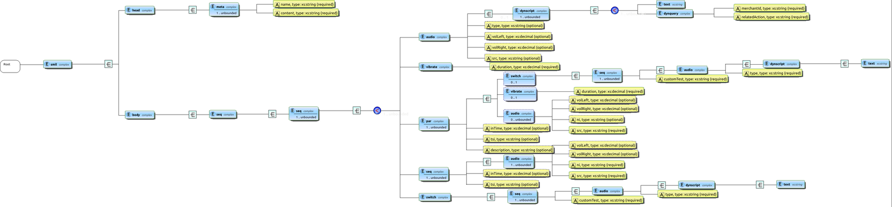

# Adaptive podcasting specification

Adaptive podcasting is based on the W3C [SMIL specification](https://www.w3.org/AudioVideo/). You can read more about why we chose [SMIL here](../docs/smil-timing-model.md).

There is a generated [XML Schema](Adaptive-podcasting-SMIL-schema.xsd) and [HTML represenation](Adaptive-podcasting-SMIL-schema.html) for development purposes only.
